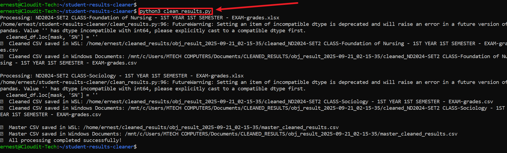
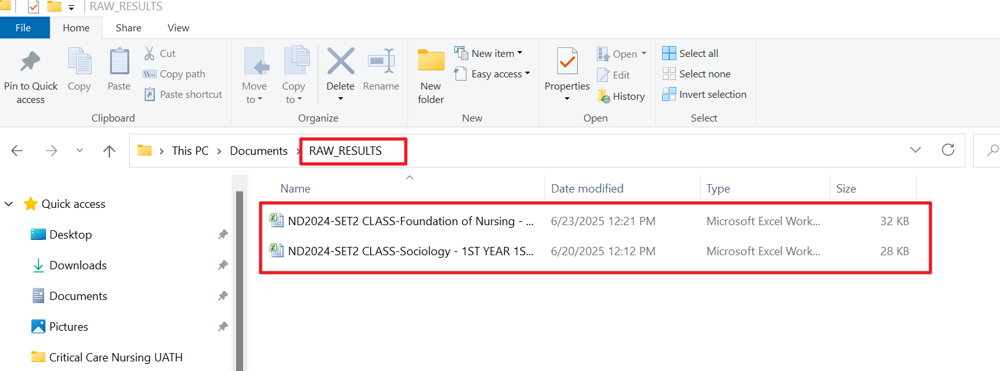
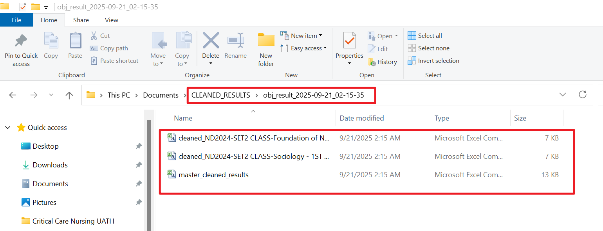
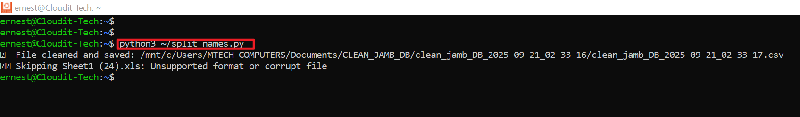
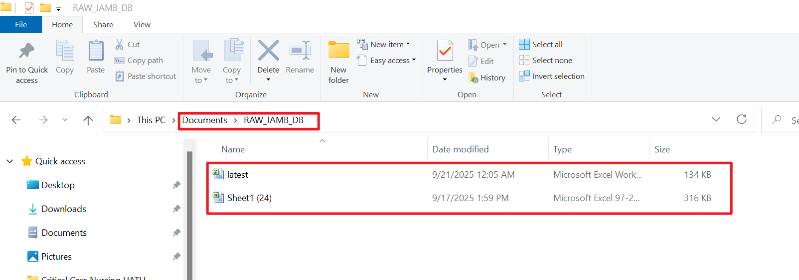
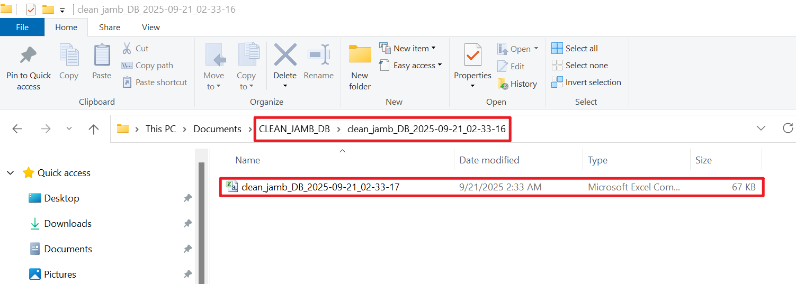

# Automated Student Data Cleaning Scripts

> This project was born out of a real challenge during the development of a **Post-UTME application portal** for **FCT College of Nursing Sciences, Gwagwalada**.  

While building the portal, our team realized that **JAMB Excel files store candidate names in a single column**, whereas our system requires the names separated into `lastName`, `firstName`, and `otherNames`. Moreover, not all columns from the JAMB file are needed for our application. Initially, we manually cleaned the files in Excel — a tedious and error-prone process.  

To streamline this, I decided to **automate the data cleaning process**. The first script (`split_names.py`) handles JAMB data. Seeing its success, I extended the idea to also clean **internal examination data** with `clean_results.py`. Now, both scripts save time, prevent manual errors, and prepare data in the exact format required for the portal.

---

### Table of Contents

- [Automated Student Data Cleaning Scripts](#automated-student-data-cleaning-scripts)
    - [Table of Contents](#table-of-contents)
  - [Prerequisites](#prerequisites)
    - [Folder Setup](#folder-setup)
    - [RAW\_RESULTS](#raw_results)
    - [CLEANED\_RESULTS](#cleaned_results)
    - [Output Structure (clean\_results.py)](#output-structure-clean_resultspy)
    - [Running `split_names.py` (JAMB Data)](#running-split_namespy-jamb-data)
    - [RAW\_RESULTS](#raw_results-1)
    - [CLEANED\_RESULTS](#cleaned_results-1)
    - [Output Structure (`split_names.py`)](#output-structure-split_namespy)
    - [Troubleshooting](#troubleshooting)
  - [Conclusion](#conclusion)

---

## Prerequisites

Ensure the following before running any scripts:

- **Windows Subsystem for Linux (WSL)** installed.
- **Python 3** installed in WSL.
- Required Python libraries installed:

```bash
pip3 install pandas openpyxl
```

### Folder Setup
**For clean_results.py** (Internal Exam Data)
1. Create these folders in your Documents:
- **RAW_RESULTS** → Place raw CSV or Excel school result files here.
    ```makefile
    C:\Users\<USERNAME>\Documents\RAW_RESULTS
    ```
- **CLEANED_RESULTS** → Script creates timestamped subfolders for cleaned files.
    ```makefile
    C:\Users\<USERNAME>\Documents\CLEANED_RESULTS
    ```
**For split_names.py** (JAMB Data)
1. Create these folders in your Documents:
- **RAW_JAMB_DB** → Place raw JAMB CSV or Excel files here.

    ```makefile
    C:\Users\<USERNAME>\Documents\RAW_JAMB_DB
    ```
- **CLEAN_JAMB_DB** → Script saves cleaned files here with timestamp.

    ```makefile
    C:\Users\<USERNAME>\Documents\CLEAN_JAMB_DB
    ```
    >Replace `<USERNAME>` with your Windows username.

**Running** `clean_results.py`
1. Place **clean_results.py** in your WSL home directory or any directory of your choice, e.g.:
    ```makefile
    /home/ernest/clean_results.py
    ```
2. Ensure execute permission:

    ```bash
    chmod +x ~/clean_results.py
    ```
3. Run the script:

```bash
python3 ~/clean_results.py
```

The script will:

- Detect CSV/Excel files in `RAW_RESULTS`.
- Clean data to keep required columns.
- Sort rows by **MAT NO**.
- Add Serial Numbers (SN), leaving SN blank for Overall Average.
- Save individual cleaned files and a master CSV in a timestamped folder in `CLEANED_RESULTS`.

### RAW_RESULTS


### CLEANED_RESULTS


### Output Structure (clean_results.py)
```txt
CLEANED_RESULTS/
└── obj_result_YYYY-MM-DD_HH-MM-SS/
    ├── cleaned_<file1>.csv
    ├── cleaned_<file2>.csv
    └── master_cleaned_results.csv
```

- Individual cleaned CSVs for each raw file.
- Master CSV combining all cleaned files.
- Overall Average row: SN blank, other columns unchanged.

### Running `split_names.py` (JAMB Data)

1. Place `split_names.py` in your WSL home directory:

    ```bash
    /home/ernest/split_names.py
    ```
2. Ensure execute permission:

    ```bash
    chmod +x ~/split_names.py
    ```
3. Run the script:

```bash
python3 ~/split_names.py
```


The script will:

- Detect CSV or Excel files in `RAW_JAMB_DB`.
- Split `RG_CANDNAME` into `lastName`, `firstName`, `otherNames`.
- Create a cleaned dataset with columns:
```nginx
| jambId | lastName | firstName | otherNames | gender | state | lga | aggregateScore |
|--------|----------|-----------|------------|--------|-------|-----|----------------|
```
>Save cleaned file to CLEAN_JAMB_DB with timestamp:

```text
clean_jamb_DB_YYYY-MM-DD_HH-MM-SS.csv
```

### RAW_RESULTS

### CLEANED_RESULTS


### Output Structure (`split_names.py`)

```text
CLEAN_JAMB_DB/
└── clean_jamb_DB_YYYY-MM-DD_HH-MM-SS.csv
```
- Only the cleaned data is stored.
- File is timestamped to avoid overwriting previous runs.
- Supports .csv, .xls, .xlsx.
- Skips unsupported or corrupt files automatically.

### Troubleshooting

| Problem                                    | Solution                                                                                 |
| ------------------------------------------ | ---------------------------------------------------------------------------------------- |
| No CSV or Excel files found                | Make sure files are in the correct RAW folder and not temporary files starting with `~$` |
| Permission denied saving to Windows folder | Ensure the target CLEANED folder exists and has write access                             |
| Script skips a file                        | File does not contain required columns                                                   |
| Python error                               | Ensure `pandas` and `openpyxl` are installed: `pip3 install pandas openpyxl`             |

## Conclusion

These scripts provide a **reliable, offline solution** for cleaning both JAMB and internal examination data, ensuring that:

- Candidate names are properly split into `lastName`, `firstName`, and `otherNames`.
- Only the necessary columns are retained.
- Data is consistently formatted and ready for upload to the application portal or internal systems.
- Process automation reduces manual errors and saves significant time.

While the portal is already in production, this offline approach allows the team to maintain **data integrity** without disrupting ongoing processes. In the future, the scripts can be **fully integrated into the portal**, enabling real-time automated data cleaning during candidate registration or exam result processing.

By combining `split_names.py` for JAMB data and `clean_results.py` for internal exam results, the workflow becomes **efficient, scalable, and maintainable**, providing a strong foundation for the college's digital data management.
